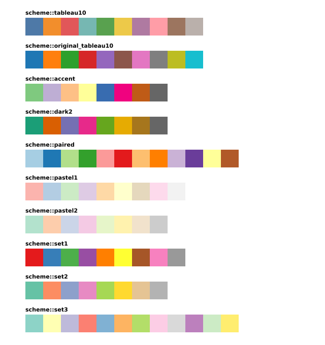
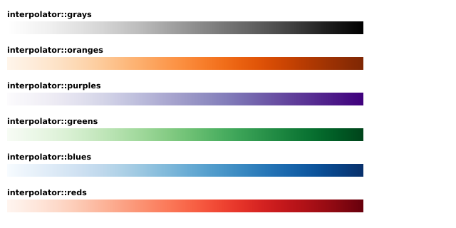
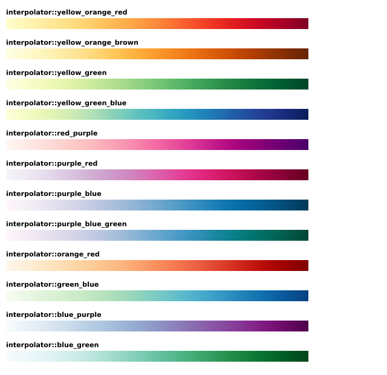
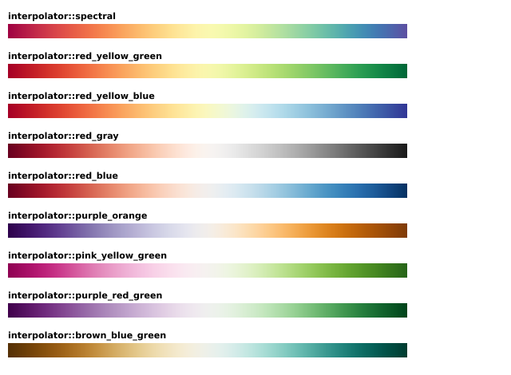
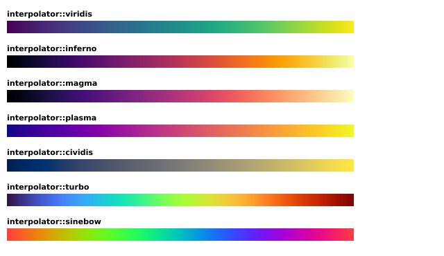
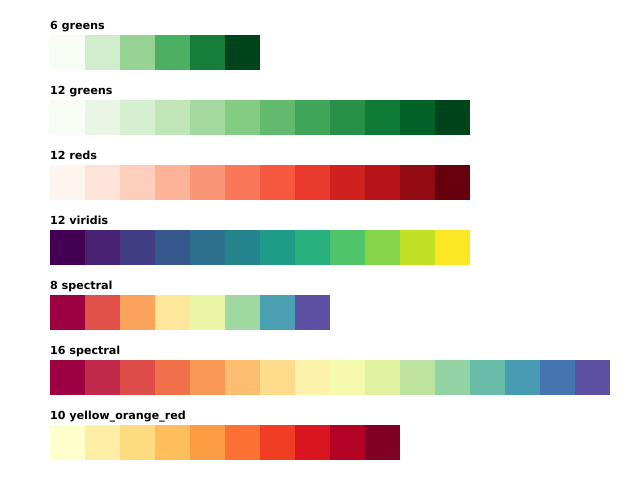

# Colors

Color is essential for many visualizations. Some time in the future there will hopefully be
standardized C++ color functionality. But for now *cdv* has its own rudimentary color
class `rgba_color`. Usually, it should be unnecessary to interact with the `rgba_color`
class directly as *cdv* provides far more convenient mechanisms for dealing with
color in the context of visualization.  

## Contents

-   [Explicitly Named Colors](#explicitly-named-colors)
-   [Schemes](#schemes)
-   [Interpolators](#interpolators)
-   [Creating Schemes From Interpolators](#creating-schemes-from-interpolators)

## Explicitly Named Colors

If you are looking to specify a single color, then the chances are high that you can
use one of the many constants that *cdv* defines out-of-the-box. All 
[140 CSS4 colors](https://www.w3schools.com/colors/colors_names.asp)
are defined in the `cdv::css4` namespace as constants of type `rgba_color`. So for 
instance, in this code:
                                                                            
```c++
constexpr auto col = cdv::css4::dodgerblue;
```

`col` is now an instance of `cdv::rgba_color` that represents the `#1E90FF`
blue color defined in the css4 specification as `DodgerBlue`. Note, that
the names are all lower case in *cdv*.

The second namespace containing explicit color names is `cdv::tab` which contains
the ten colors of the [New Tableau 10]() palette. Just like with the `css4`
colors, you can use them anywhere where an `rgba_color` instance is required.
For example, this would give you an instance of `rgba_color` representing
the Tableau 10 green color:

```c++
constexpr auto col = cdv::tab::green;
```


## Schemes

Often in data visualization you do not want to specify just a single color, you want
to specify a color scheme. That is you want the colors of certain elements to be
chosen from a predefined palette of colors. *cdv* supports this in the form of
predefined arrays of `rgba_color` instances. These arrays are defined in the
`cdv::scheme` namespace and can be used wherever a range of colors is required. For instance,

```c++
const auto color = cdv::scl::ordinal_scale(keys, cdv::scheme::pastel1);
```
<sup><a href='/tests/approval_tests/cdv/fig/tutorial.cpp#L167-L167' title='Go to snippet source file'>source</a></sup>

can be used to create an ordinal scale that maps a range of keys - say strings, for 
example - to the array of colors defined by the color scheme `cdv::scheme::pastel1`.

These are the color schemes that are currently defined in *cdv*:



There is another kind of color scheme that is available directly in *cdv*: color schemes
generated from *interpolators*. But to understand them, we first need to take a look
at what color interpolators are.

## Interpolators

Color schemes are useful when you would like to select colors from a predefined
palette of some number of colors. However, a common operation in data visualization
is to color things according to their value with reference to some smooth transition
of colors. An example might be the visualization of data points that represent
temperature. In that case it might be very useful to color the points from blue to
red as they grow from colder to hotter. What we need to be able to do is
interpolate such a transition of colors according to the temperature. 

This is the role of *interpolators*. Interpolators reside in the `cdv::interpolator` namespace
and are in fact functions that represent arbitrarily complex transitions of
color. *cdv* provides has many predefined interpolators based on those provided by d3.js.
Interpolators are commonly combined with sequential scales to provide the kind of mapping
discussed above where some range of values (in that case temperatures) is mapped to
some transition of colors. For instance, in this example:

```c++
const auto color = cdv::scl::sequential_scale(4.0, 10.0, cdv::interpolator::viridis);
```
<sup><a href='/tests/approval_tests/cdv/fig/tutorial.cpp#L199-L199' title='Go to snippet source file'>source</a></sup>

the value range [4, 10] is mapped to the color transition defined by the `viridis`
interpolator. So if we applied that scale to the value 7, we would get the color
from the middle of the `viridis` interpolator. As stated above, *cdv* defines a lot
of interpolators which are based on those defined in 
[d3.js](https://github.com/d3/d3-scale-chromatic/)
and are all listed here:

#### Single Hue Interpolators




#### Multiple Hue Interpolators




#### Diverging Interpolators




#### Other Interpolators



- **viridis** designed by [van der Walt, Smith and Firing](https://bids.github.io/colormap/)
- **inferno**, **magma** and **plasma** designed by [van der Walt and Smith](https://bids.github.io/colormap/)
- **cividis** designed by [Nuñez, Anderton, and Renslow](https://journals.plos.org/plosone/article?id=10.1371/journal.pone.0199239)
- **turbo** designed by [Anton Mikhailov](https://ai.googleblog.com/2019/08/turbo-improved-rainbow-colormap-for.html)
- **sinebow** designed by [Jim Bumgardner](https://krazydad.com/tutorials/makecolors.php) 
    and [Charlie Loyd](http://basecase.org/env/on-rainbows).


## Creating Schemes From Interpolators

In the [Schemes](#schemes) section above, it was mentioned that we can create schemes from
interpolators, and because this is all `constexpr` it can happen at compile time. There is
a function (a function template, to be precise) in the `cdv::scheme` namespace called 
`from_interpolator` which allows us to generate arbitrarily sized schemes from interpolators
at compile time. So, for instance, the following code:

```c++
constexpr auto six_greens = cdv::scheme::from_interpolator<6>(cdv::interpolator::greens);
```

will create an array of six `rgba_color`s spread out across the transition of colors
defined by the `greens` interpolator. Here are some examples of the sort of schemes
that can be generated in this way:


