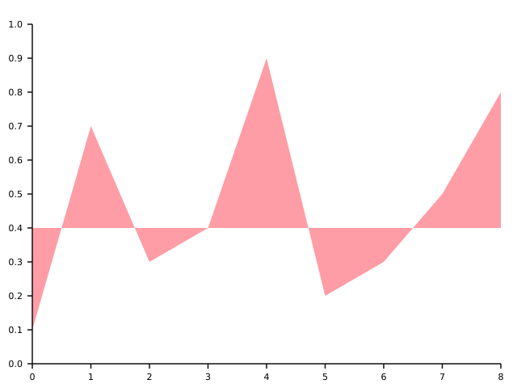
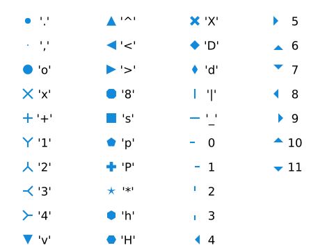
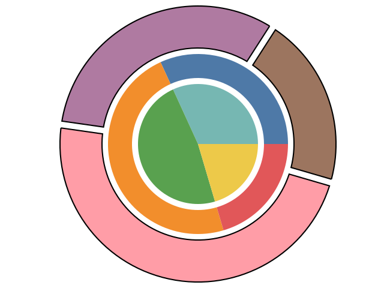

# elem

Definition of renderable elements and associated functionality

***


|File|Description|
| :-- | :-- |
| [area.hpp](#areahpp) | filled area delineated by lines and `fill_between` functions for creating areas |
| [symbol_properties.hpp](#symbol_propertieshpp) | properties of symbols as used for instance in scatter plots |
| [line_properties.hpp](#line_propertieshpp) | line drawing properties |
| [pie_slices.hpp](#pie_sliceshpp) | create a pie slice generator from an input range of values |
| [fill_properties.hpp](#fill_propertieshpp) | properties of elements that can be filled e.g. `area` or `rectangle` |
| [color_legend.hpp](#color_legendhpp) | legend element created from ordinal or sequential scales that map to colors |
| [rectangle.hpp](#rectanglehpp) | rectangular shaped element |
| [swatch_legend.hpp](#swatch_legendhpp) | legend element created from ordinal scales organized in columns of color swatches |
| [text_properties.hpp](#text_propertieshpp) | properties determining the rendering of text |
| [line.hpp](#linehpp) | line element representing one or more linear segments |
| [arc.hpp](#archpp) | filled circles and rings including circle and ring segments |
| [scatter.hpp](#scatterhpp) | multiple similar symbols as a single element |
| [symbol.hpp](#symbolhpp) | a single symbol as a single element |
| [axis.hpp](#axishpp) | generate lines, ticks and labels from a scale to represent an axis |
| [range_stack.hpp](#range_stackhpp) | stack multiple ranges on top of each other |
| [text.hpp](#texthpp) | element representing normal text and/or mathematical formulas |


## area.hpp

Source: [cdv/elem/area.hpp](/include/cdv/elem/area.hpp)


### area<XRange, YRange>

```c++
template <class XRange, class YRange>
struct cdv::elem::area;
```

|Field|Type|Description|
| :-- | :-- | :-- |
| fill | `cdv::elem::fill_properties` | properties which determine how the area should be filled |
| xs | `XRange` | the x coordinates of the delimiting polyline |
| ys | `YRange` | the y coordinates of the delimiting polyline |


An area is a highly flexible element which can represent any shape that can be enclosed in
a polyline. One common use of an area is in area charts for which there are convenience
functions which help to create areas, see [fill_between](#fill_between).


#### Constructor: area<XRange, YRange>

area constructor

```c++
area<XRange, YRange>(const XRange & xs, const YRange & ys, cdv::elem::fill_properties fill)
```

> Constructs an `area` from the given parameters. Note that the sizes of the `xs` and `ys` ranges must be equal otherwise an exception is thrown.

|Argument|Description|
| :-- | :-- |
| xs | the x coordinates of the delimiting polyline as a range of pixels |
| ys | the y coordinates of the delimiting polyline as a range of pixels |
| fill | properties which determine how the area should be filled |


<br />


### fill_between

creates an area for x values by filling between y values

**Overload 1:**

```c++
template <class XRange, class TopYRange, class BaseYRange>
auto fill_between(const XRange & xs, const TopYRange & top_ys, const BaseYRange & base_ys, const cdv::elem::fill_properties & fill)
```

> Creates an `area` for the given x coordinates that fills the area between the two ranges of y coordinates that are passed in. The two ranges of y coordinates must both correspond to the given x coordinates. The area is formed by taking the `top_ys` in reverse order and then appending the `base_ys`. The resulting polyline defines the area. This is useful when filling the area defined by two lines in a chart. Both lines share the same x coordinates. The upper y values would be the `top_ys` the lower y coordinates would be the `base_ys`.

|Argument|Description|
| :-- | :-- |
| xs | the x coordinates |
| top_ys | the y coordinates that define the upper line |
| base_ys | the y coordinates that define the lower line |
| fill | properties which determine how the area should be filled |


**Overload 2:**

```c++
template <class XRange, class YRange, typename YType>
auto fill_between(const XRange & xs, const YRange & ys, const YType & y, const cdv::elem::fill_properties & fill)
```

> Creates an `area` for the given x coordinates that fills the area between the range of y coordinates and the constant value that are passed in. The range of y coordinates corresponds to the x coordinates and must have the same size in order to define a line. The area is defined by the points of that line in reverse order followed by the first x coordinate and the constant y value and then the last x coordinate and the constant y value. This essentially creates an area between the line defined by the `xs` and `ys` and the horizontal line defined by the `y` value.

|Argument|Description|
| :-- | :-- |
| xs | the x coordinates |
| ys | the y coordinates that define the line |
| y | the y value that defines the constant value to fill to |
| fill | properties which determine how the area should be filled |


The following example uses `fill_between` to create an area defined by the line given by 
`xs` and `ys` (which are transformed into pixel space by appropriate scales) and the
constant value 0.4:

```c++
const auto area =
    elem::fill_between(xs | rv::transform(x), ys | rv::transform(y), y(0.4), {.color = tab::pink});
```
<sup><a href='/tests/approval_tests/cdv/fig/area_charts.cpp#L55-L56' title='Go to snippet source file'>source</a></sup>

when plotted with axes the area looks like this:




<br />


## symbol_properties.hpp

Source: [cdv/elem/symbol_properties.hpp](/include/cdv/elem/symbol_properties.hpp)


### symbol_properties

```c++

struct cdv::elem::symbol_properties;
```

|Field|Type|Description|
| :-- | :-- | :-- |
| color | `cdv::rgba_color` | the color of the symbol |
| style | `char` | the style of the symbol (see below for more information) |


The symbol styles provided by *cdv* are based on the marker styles that will
be familiar to matplotlib users. They are specified in the form of `char` values. For 
instance, the syle value `'*'` represents a five pointed star symbol. Here is a complete
list of the supported symbols and their corresponding `char` values:




## line_properties.hpp

Source: [cdv/elem/line_properties.hpp](/include/cdv/elem/line_properties.hpp)


### line_properties

```c++

struct cdv::elem::line_properties;
```

|Field|Type|Description|
| :-- | :-- | :-- |
| cap | `cdv::elem::cap_style` | the style in which the ends of lines are drawn (see [cap_style](#enumeration_cap_style)) |
| color | `cdv::rgba_color` | the color of the line |
| join | `cdv::elem::join_style` | the style in which connected line segments are joined together (see [join_style](#enumeration_join_style)) |
| style | `cdv::elem::line_type` | the line style: solid, dashed etc. (see [line_type](#line_type)) |
| width | `cdv::points` | the width of the line |


Lines appear in various different contexts in *cdv*. For example as parts of axes
or legends, or as outlines of filled shapes or simply as `line` objects. Their
appearance in all of these contexts can be controlled using the `line_properties`
data structure.


### line_type

```c++

class cdv::elem::line_type;
```

|Field|Type|Description|
| :-- | :-- | :-- |
| dash_sequence | `std::vector<double>` | __MISSING__ |


#### operator=

__MISSING__

```c++
cdv::elem::line_type & operator=(cdv::elem::line_type &&)
```


<br />


#### Destructor: ~line_type

__MISSING__

```c++
~line_type()
```


<br />


#### Constructor: line_type

__MISSING__

**Overload 1:**

```c++
line_type()
```

> __MISSING__

**Overload 2:**

```c++
line_type(cdv::elem::line_type &&)
```

> __MISSING__

**Overload 3:**

```c++
line_type(const cdv::elem::line_type &)
```

> __MISSING__

**Overload 4:**

```c++
line_type(const char * s)
```

> __MISSING__

**Overload 5:**

```c++
line_type(std::string_view s)
```

> __MISSING__


<br />


#### Enumeration: join_style

```c++
enum class cdv::elem::join_style
```

__MISSING__

|Name|Description|
| :-- | :-- |
| miter | __MISSING__ |
| round | __MISSING__ |
| bevel | __MISSING__ |


<br />

#### Enumeration: cap_style

```c++
enum class cdv::elem::cap_style
```

__MISSING__

|Name|Description|
| :-- | :-- |
| butt | __MISSING__ |
| square | __MISSING__ |
| round | __MISSING__ |


<br />

## pie_slices.hpp

Source: [cdv/elem/pie_slices.hpp](/include/cdv/elem/pie_slices.hpp)


### pie_slice<Data>

```c++
template <typename Data>
struct cdv::elem::pie_slice;
```

|Field|Type|Description|
| :-- | :-- | :-- |
| data | `const Data &` | __MISSING__ |
| end_angle | `cdv::radians` | __MISSING__ |
| pad_angle | `cdv::radians` | __MISSING__ |
| start_angle | `cdv::radians` | __MISSING__ |


### pie_geometry

```c++

struct cdv::elem::pie_geometry;
```

|Field|Type|Description|
| :-- | :-- | :-- |
| end_angle | `cdv::radians` | __MISSING__ |
| pad_angle | `cdv::radians` | __MISSING__ |
| start_angle | `cdv::radians` | __MISSING__ |


#### Destructor: ~pie_geometry

__MISSING__

```c++
~pie_geometry()
```


<br />


### label_angle

__MISSING__

```c++
template <typename Data>
auto label_angle(const pie_slice<Data> & slice)
```


<br />


### pie_slices

__MISSING__

```c++
template <typename Data, class inputs:auto, class get_value:auto>
cppcoro::generator<pie_slice<Data>> pie_slices(const stdx::range_of<Data> auto & inputs, const ranges::invocable<Data> auto & get_value, const cdv::elem::pie_geometry & geometry)
```


<br />


### centroid

__MISSING__

```c++
template <typename Data>
auto centroid(const pie_slice<Data> & slice, const cdv::pixel_pos center, const cdv::pixels radius)
```


<br />


## fill_properties.hpp

Source: [cdv/elem/fill_properties.hpp](/include/cdv/elem/fill_properties.hpp)


### fill_properties

```c++

struct cdv::elem::fill_properties;
```

|Field|Type|Description|
| :-- | :-- | :-- |
| color | `cdv::rgba_color` | __MISSING__ |
| outline | `cdv::elem::line_properties` | __MISSING__ |


## color_legend.hpp

Source: [cdv/elem/color_legend.hpp](/include/cdv/elem/color_legend.hpp)


### color_legend<Scale>

```c++
template <typename Scale>
struct cdv::elem::color_legend;
```

|Field|Type|Description|
| :-- | :-- | :-- |
| block_height | `cdv::pixels` | __MISSING__ |
| height | `cdv::pixels` | __MISSING__ |
| num_ticks_hint | `size_t` | __MISSING__ |
| padding | `double` | __MISSING__ |
| pos | `cdv::pixel_pos` | __MISSING__ |
| scale | `Scale` | __MISSING__ |
| tick_label_properties | `cdv::elem::text_properties` | __MISSING__ |
| tick_length | `cdv::pixels` | __MISSING__ |
| tick_line_properties | `cdv::elem::line_properties` | __MISSING__ |
| title | `std::string` | __MISSING__ |
| title_offset | `cdv::pixel_pos` | __MISSING__ |
| title_properties | `cdv::elem::text_properties` | __MISSING__ |
| width | `cdv::pixels` | __MISSING__ |


### draw

__MISSING__

```c++
template <typename Scale, typename Surface>
void draw(const color_legend<Scale> & l, Surface & surface, const cdv::pixel_pos)
```


<br />


## rectangle.hpp

Source: [cdv/elem/rectangle.hpp](/include/cdv/elem/rectangle.hpp)


### rectangle

```c++

struct cdv::elem::rectangle;
```

|Field|Type|Description|
| :-- | :-- | :-- |
| corner_radius | `cdv::pixels` | __MISSING__ |
| fill | `cdv::elem::fill_properties` | __MISSING__ |
| max | `cdv::pixel_pos` | __MISSING__ |
| min | `cdv::pixel_pos` | __MISSING__ |


### draw

__MISSING__

```c++
template <typename Surface>
void draw(const cdv::elem::rectangle & r, Surface & surface, cdv::pixel_pos)
```


<br />


## swatch_legend.hpp

Source: [cdv/elem/swatch_legend.hpp](/include/cdv/elem/swatch_legend.hpp)


### swatch_legend<Domain>

```c++
template <typename Domain>
struct cdv::elem::swatch_legend;
```

|Field|Type|Description|
| :-- | :-- | :-- |
| block_height | `cdv::pixels` | __MISSING__ |
| block_width | `cdv::pixels` | __MISSING__ |
| columns | `std::vector<pixels>` | __MISSING__ |
| label_format_specifier | `std::string` | __MISSING__ |
| label_properties | `cdv::elem::text_properties` | __MISSING__ |
| pos | `cdv::pixel_pos` | __MISSING__ |
| scale | `scl::ordinal_scale<Domain, rgba_color>` | __MISSING__ |
| title | `std::string` | __MISSING__ |
| title_offset | `cdv::pixel_pos` | __MISSING__ |
| title_properties | `cdv::elem::text_properties` | __MISSING__ |


### draw

__MISSING__

```c++
template <typename Domain, typename Surface>
void draw(const swatch_legend<Domain> & l, Surface & surface, const cdv::pixel_pos)
```


<br />


## text_properties.hpp

Source: [cdv/elem/text_properties.hpp](/include/cdv/elem/text_properties.hpp)


### text_properties

```c++

struct cdv::elem::text_properties;
```

|Field|Type|Description|
| :-- | :-- | :-- |
| color | `cdv::rgba_color` | __MISSING__ |
| font | `fnt::font_properties` | __MISSING__ |
| font_size | `cdv::points` | __MISSING__ |


#### Enumeration: horizontal_anchor

```c++
enum class cdv::elem::horizontal_anchor
```

__MISSING__

|Name|Description|
| :-- | :-- |
| left | __MISSING__ |
| center | __MISSING__ |
| right | __MISSING__ |


<br />

#### Enumeration: vertical_anchor

```c++
enum class cdv::elem::vertical_anchor
```

__MISSING__

|Name|Description|
| :-- | :-- |
| bottom | __MISSING__ |
| middle | __MISSING__ |
| top | __MISSING__ |


<br />

## line.hpp

Source: [cdv/elem/line.hpp](/include/cdv/elem/line.hpp)


### line<XRange, YRange>

```c++
template <class XRange, class YRange>
struct cdv::elem::line;
```

|Field|Type|Description|
| :-- | :-- | :-- |
| properties | `cdv::elem::line_properties` | __MISSING__ |
| xs | `XRange` | __MISSING__ |
| ys | `YRange` | __MISSING__ |


#### Constructor: line<XRange, YRange>

__MISSING__

```c++
line<XRange, YRange>(XRange xs, YRange ys, cdv::elem::line_properties properties)
```


<br />


### vline

__MISSING__

```c++
cdv::elem::line<std::__1::array<mfl::detail::quantity<mfl::pixels_tag>, 2>, std::__1::array<mfl::detail::quantity<mfl::pixels_tag>, 2>> vline(const cdv::pixels x, const cdv::pixels y0, const cdv::pixels y1, cdv::elem::line_properties properties)
```


<br />


### hline

__MISSING__

```c++
cdv::elem::line<std::__1::array<mfl::detail::quantity<mfl::pixels_tag>, 2>, std::__1::array<mfl::detail::quantity<mfl::pixels_tag>, 2>> hline(const cdv::pixels x0, const cdv::pixels x1, const cdv::pixels y, cdv::elem::line_properties properties)
```


<br />


### draw

__MISSING__

```c++
template <class XRange, class YRange, typename Surface>
void draw(const line<XRange, YRange> & ln, Surface & surface, const cdv::pixel_pos &)
```


<br />


## arc.hpp

Source: [cdv/elem/arc.hpp](/include/cdv/elem/arc.hpp)


### arc

```c++

struct cdv::elem::arc;
```

|Field|Type|Description|
| :-- | :-- | :-- |
| center | `cdv::pixel_pos` | the center of the circle that defines the arc |
| end_angle | `cdv::radians` | the angle at which the arc ends (default is 2π radians) |
| fill | `cdv::elem::fill_properties` | properties which determine how the arc should be filled |
| inner_radius | `cdv::pixels` | the inner radius of the arc. Set this to a value greater than zero in order to represent a ring (segment) rather than a circle (segment) (default is 0 - i.e. no inner radius) |
| outer_radius | `cdv::pixels` | the outer radius of the arc. This is the radius of the circle (segment) if the inner radius is zero and the outer radius of the ring (segment) if the inner radius is positive. |
| pad_angle | `cdv::radians` | the amound of padding to apply to each end of the arc. When drawing a segment rather than a complete circle or ring, this value can be used to apply padding. The padding is applied at the outer radius and then projected inwards to the inner radius so that the edges of the gap between two segments are parallel. The results may look strange when applying padding to circle segments rather than ring segments (default is 0 - i.e. no padding) |
| start_angle | `cdv::radians` | the angle at which the arc starts (default is 0 radians) |


Arcs are particularly useful when drawing pie or donut charts. They can be generated conveniently
using [pie slices](#pie_slices).

As an example of an arc, this definition

```c++
const auto arc00 = elem::arc{.center = frame.center(),
                             .outer_radius = 150_px,
                             .inner_radius = 110_px,
                             .start_angle = 0_rad,
                             .end_angle = 2_rad,
                             .fill = {.color = tab::blue}};
```
<sup><a href='/tests/approval_tests/cdv/fig/pie_charts.cpp#L143-L148' title='Go to snippet source file'>source</a></sup>

generates the blue ring segment in the middle ring in the following image:



Note how the above image also demonstrates an inner radius of zero (the pie in the center) and the use of the
pad angle to separate each segment slightly in the outer ring.


## scatter.hpp

Source: [cdv/elem/scatter.hpp](/include/cdv/elem/scatter.hpp)


### scatter<XRange, YRange, SizeRange>

```c++
template <class XRange, class YRange, class SizeRange>
struct cdv::elem::scatter;
```

|Field|Type|Description|
| :-- | :-- | :-- |
| properties | `cdv::elem::symbol_properties` | __MISSING__ |
| sizes | `SizeRange` | __MISSING__ |
| xs | `XRange` | __MISSING__ |
| ys | `YRange` | __MISSING__ |


#### Constructor: scatter<XRange, YRange, SizeRange>

__MISSING__

**Overload 1:**

```c++
scatter<XRange, YRange, SizeRange>(const XRange & xs, const YRange & ys, const SizeRange & sizes, const cdv::elem::symbol_properties & properties)
```

> __MISSING__

**Overload 2:**

```c++
scatter<XRange, YRange, SizeRange>(const XRange & xs, const YRange & ys, const cdv::elem::symbol_properties & properties)
```

> __MISSING__


<br />


### draw

__MISSING__

```c++
template <class XRange, class YRange, typename Surface, class SizeRange>
void draw(const scatter<XRange, YRange, SizeRange> & s, Surface & surface, const cdv::pixel_pos &)
```


<br />


## symbol.hpp

Source: [cdv/elem/symbol.hpp](/include/cdv/elem/symbol.hpp)


### symbol

```c++

struct cdv::elem::symbol;
```

|Field|Type|Description|
| :-- | :-- | :-- |
| position | `cdv::pixel_pos` | __MISSING__ |
| properties | `cdv::elem::symbol_properties` | __MISSING__ |
| size | `cdv::points` | __MISSING__ |


### draw

__MISSING__

```c++
template <typename Surface>
void draw(const cdv::elem::symbol & s, Surface & surface, const cdv::pixel_pos)
```


<br />


## axis.hpp

Source: [cdv/elem/axis.hpp](/include/cdv/elem/axis.hpp)


### axis<Scale>

```c++
template <typename Scale>
struct cdv::elem::axis;
```

|Field|Type|Description|
| :-- | :-- | :-- |
| orientation | `cdv::elem::axis_orientation` | __MISSING__ |
| position | `cdv::elem::axis::codomain_t` | __MISSING__ |
| properties | `axis_properties<cdv::elem::axis::codomain_t>` | __MISSING__ |
| scale | `Scale` | __MISSING__ |


|Nested Typedef|Type|Description|
| :-- | :-- | :-- |
| codomain_t | `typename Scale::codomain_t` | __MISSING__ |


### axis_properties<Codomain>

```c++
template <typename Codomain>
struct cdv::elem::axis_properties;
```

|Field|Type|Description|
| :-- | :-- | :-- |
| grid | `cdv::elem::line_properties` | __MISSING__ |
| grid_length | `Codomain` | __MISSING__ |
| num_ticks_hint | `size_t` | __MISSING__ |
| spine | `cdv::elem::line_properties` | __MISSING__ |
| tick_label_offset | `cdv::pixel_pos` | __MISSING__ |
| tick_labels | `cdv::elem::text_properties` | __MISSING__ |
| tick_length | `Codomain` | __MISSING__ |
| ticks | `cdv::elem::line_properties` | __MISSING__ |


### top_axis

__MISSING__

```c++
template <typename Scale, typename Codomain>
auto top_axis(const Scale & scale, const Codomain & position, const axis_properties<Codomain> & properties)
```


<br />


### right_axis

__MISSING__

```c++
template <typename Scale, typename Codomain>
auto right_axis(const Scale & scale, const Codomain & position, const axis_properties<Codomain> & properties)
```


<br />


#### Enumeration: axis_orientation

```c++
enum class cdv::elem::axis_orientation
```

__MISSING__

|Name|Description|
| :-- | :-- |
| left | __MISSING__ |
| right | __MISSING__ |
| top | __MISSING__ |
| bottom | __MISSING__ |


<br />

### bottom_axis

__MISSING__

```c++
template <typename Scale, typename Codomain>
auto bottom_axis(const Scale & scale, const Codomain & position, const axis_properties<Codomain> & properties)
```


<br />


### left_axis

__MISSING__

```c++
template <typename Scale, typename Codomain>
auto left_axis(const Scale & scale, const Codomain & position, const axis_properties<Codomain> & properties)
```


<br />


### draw

__MISSING__

```c++
template <typename Scale, typename Surface>
void draw(const axis<Scale> & ax, Surface & surface, const cdv::pixel_pos &)
```


<br />


## range_stack.hpp

Source: [cdv/elem/range_stack.hpp](/include/cdv/elem/range_stack.hpp)


### range_stack<Key, Value>

```c++
template <typename Key, typename Value>
class cdv::elem::range_stack;
```

|Nested Typedef|Type|Description|
| :-- | :-- | :-- |
| layer_t | `std::vector<std::pair<Value, Value>>` | __MISSING__ |


#### Constructor: range_stack<Key, Value>

__MISSING__

**Overload 1:**

```c++
template <class RngOfRngs, class keys:auto>
range_stack<Key, Value>(const RngOfRngs & range_of_ranges, const stdx::range_of<Key> auto & keys)
```

> __MISSING__

**Overload 2:**

```c++
template <class RngOfRngs, typename InnerType, class keys:auto>
range_stack<Key, Value>(const RngOfRngs & range_of_ranges, const stdx::range_of<Key> auto & keys, const InnerType base_value)
```

> __MISSING__


<br />


#### layer

__MISSING__

```c++
const cdv::elem::range_stack::layer_t & layer(const Key & key) const
```


<br />


## text.hpp

Source: [cdv/elem/text.hpp](/include/cdv/elem/text.hpp)


### text

```c++

struct cdv::elem::text;
```

|Field|Type|Description|
| :-- | :-- | :-- |
| pos | `cdv::pixel_pos` | __MISSING__ |
| properties | `cdv::elem::text_properties` | __MISSING__ |
| rotation | `cdv::radians` | __MISSING__ |
| string | `std::string` | __MISSING__ |
| x_anchor | `cdv::elem::horizontal_anchor` | __MISSING__ |
| y_anchor | `cdv::elem::vertical_anchor` | __MISSING__ |


#### operator=

__MISSING__

```c++
cdv::elem::text & operator=(cdv::elem::text &&)
```


<br />


#### Constructor: text

__MISSING__

**Overload 1:**

```c++
text(cdv::elem::text &&)
```

> __MISSING__

**Overload 2:**

```c++
text(const cdv::elem::text &)
```

> __MISSING__


<br />


### draw

__MISSING__

```c++
template <typename Surface>
void draw(const cdv::elem::text & t, Surface & surface, const cdv::pixel_pos &)
```


<br />


