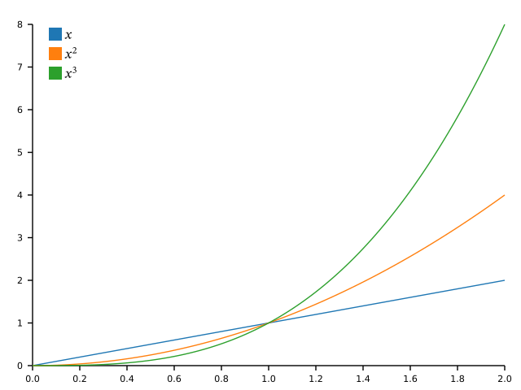
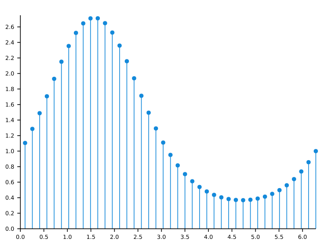
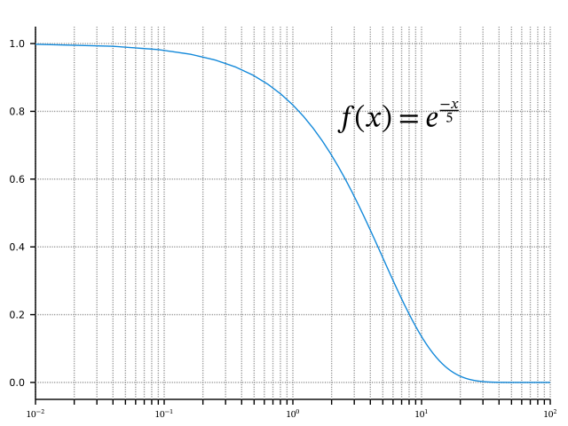
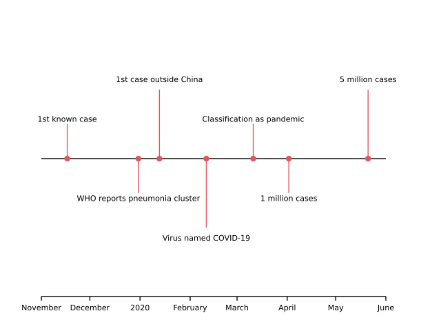

# Examples

This page provides a sampling of visualizations that can be created using *cdv* along with
the code that was used to generate them. If you are new to *cdv* you may find it helpful
to go through the [tutorial](/doc/tutorial.md) first. There you will learn about many of 
the ideas that these examples build upon and it should be much easier to understand the
code here having completed the tutorial.

The examples often assume a prior 
- `using namespace ::cdv;`
- `using namespace ::cdv::units_literals;`
- `namespace rv = ::ranges::views;`

## Contents

-   [Simple Line Plot](#simple-line-plot)
-   [Stacked Area Chart](#stacked-area-chart)
-   [Stem Plot](#stem-plot)
-   [Logarithmic Axis](#logarithmic-axis)
-   [Time Line](#time-line)
-   [Scatter Plot](#scatter-plot)
-   [Sharing Axes](#sharing-axes)
-   [Bar Chart Distribution](#bar-chart-distribution)
-   [Grouped Bar Chart](#grouped-bar-chart)

## Simple Line Plot

This example is based on a similar matplotlib example where we generate curves for
x, x squared and x cubed functions for x in [0, 2]. We also create a legend using
the same color scale that was used to choose the colors for the curves. Notice, that
the legend text is in *TeX* format and rendered as a mathematical formula.



```c++
const auto x1 = rv::linear_distribute(0.0, 2.0, 100);
const auto x2 = x1 | rv::transform([](auto x) { return x * x; });
const auto x3 = x1 | rv::transform([](auto x) { return x * x * x; });
```
<sup><a href='/tests/approval_tests/cdv/fig/line_charts.cpp#L34-L36' title='Go to snippet source file'>source</a></sup>
```c++
constexpr auto frame = fig::frame();
const auto x = scl::linear_scale(0.0, 2.0, frame.x0(), frame.x1());
const auto y = scl::linear_scale(0.0, 8.0, frame.y0(), frame.y1());

const auto x_axis = elem::bottom_axis(x, frame.y0());
const auto y_axis = elem::left_axis(y, frame.x0());

const auto keys = std::array{"$x$", "$x^2$", "$x^3$"};
const auto color = scl::ordinal_scale(keys, scheme::original_tableau10);
const auto linear = elem::line(x1 | rv::transform(x), x1 | rv::transform(y), {.color = color(keys[0])});
const auto quadratic = elem::line(x1 | rv::transform(x), x2 | rv::transform(y), {.color = color(keys[1])});
const auto cubic = elem::line(x1 | rv::transform(x), x3 | rv::transform(y), {.color = color(keys[2])});

const auto legend = elem::swatch_legend<const char*>{.scale = color,
                                                     .pos = {frame.x0() + 20_px, frame.y1() - 20_px},
                                                     .label_properties = {.font_size = 12_pt},
                                                     .columns = {200_px}};

const auto svg =
    fig::render_to_svg_string(frame.dimensions(), x_axis, y_axis, linear, quadratic, cubic, legend);
```
<sup><a href='/tests/approval_tests/cdv/fig/line_charts.cpp#L42-L61' title='Go to snippet source file'>source</a></sup>


## Stacked Area Chart

Here we feed the data ranges into a *cdv* data structure called a `range_stack` which
effectively adds each new data set to the layer below it. This is very useful when
drawing stacked charts such as stacked bar charts, or in this case a stacked area chart:


```c++
const auto frame = fig::frame();
const auto x = scl::linear_scale(0.0, 8.0, frame.x0(), frame.x1());
const auto y = scl::linear_scale(0.0, 4.0, frame.y0(), frame.y1());

const auto x_axis = elem::bottom_axis(x, frame.y0());
const auto y_axis = elem::left_axis(y, frame.x0());

constexpr auto x_values = rv::linear_distribute(0.0, 8.0, 9);

constexpr auto keys = std::array{"<10", "10-20", "20-30", "30-40", "40-50"};
const auto data = elem::range_stack(std::array{std::array{0.1, 0.7, 0.3, 0.4, 0.9, 0.2, 0.3, 0.5, 0.8},
                                               std::array{0.3, 0.2, 0.5, 0.0, 0.4, 0.5, 0.3, 0.5, 0.4},
                                               std::array{0.4, 0.2, 0.7, 0.9, 0.5, 0.4, 0.2, 0.9, 0.3},
                                               std::array{0.5, 0.7, 0.9, 0.3, 0.7, 0.1, 0.7, 0.2, 0.7},
                                               std::array{0.8, 0.4, 0.4, 0.5, 0.6, 0.6, 0.2, 0.8, 0.2}},
                                    keys, 0.0);

const auto color = scl::ordinal_scale(keys, scheme::tableau10);
const auto areas =
    keys | rv::transform([&](const auto& key) {
        const auto& layer = data.layer(key);
        return elem::fill_between(x_values | rv::transform(x), rv::keys(layer) | rv::transform(y),
                                  rv::values(layer) | rv::transform(y), {.color = color(key)});
    });

const auto legend = elem::color_legend<decltype(color)>{
    .scale = color, .pos = {370_px, 420_px}, .width = 250_px, .height = 25_px, .block_height = 10_px};

const auto svg = fig::render_to_svg_string(frame.dimensions(), areas, x_axis, y_axis, legend);
```
<sup><a href='/tests/approval_tests/cdv/fig/area_charts.cpp#L80-L108' title='Go to snippet source file'>source</a></sup>


## Stem Plot

Again we replicate a matplotlib example here. This demonstrates how simple it is to
generate multiple elements for each data point. Here, both the marker and the stem
are simply returned as a pair. So we end up with a range of pairs of elements which
can just be passed to the render function as is.



```c++
const auto frame = fig::frame();
const auto x = scl::linear_scale(0.0, 2.0 * stdx::numbers::pi, frame.x0(), frame.x1());
const auto y = scl::linear_scale(0.0, 2.75, frame.y0(), frame.y1());

const auto x_axis = elem::bottom_axis(x, frame.y0());
const auto y_axis = elem::left_axis(y, frame.x0());

const auto xs = rv::linear_distribute(0.1, x.domain()[1], 41);
const auto ys = xs | rv::transform([](const auto value) { return std::exp(std::sin(value)); });

const auto stems = rv::zip_with(
    [&](const auto a, const auto b) {
        const auto pos = pixel_pos{x(a), y(b)};
        return std::pair{elem::symbol{.position = pos, .properties = {.color = cdv_blue}},
                   elem::line(std::array{pos.x, pos.x}, std::array{y(0.0), pos.y}, {.color = cdv_blue})};
    },
    xs, ys);

const auto svg = fig::render_to_svg_string({}, stems, x_axis, y_axis);
```
<sup><a href='/tests/approval_tests/cdv/fig/scatter_charts.cpp#L119-L137' title='Go to snippet source file'>source</a></sup>


## Logarithmic Axis

In *cdv* you can use logarithmic axes for the x-axis, the y-axis or both. Here we see 
an example of using a base 10 logarithmic axis for the x-axis. Note also how the
overlaid formula is again specified in *TeX* syntax. *cdv* has built in support for
rendering mathematical formulas without having to install *LaTeX* or some similar
package. 



```c++
constexpr auto frame = fig::frame();
const auto x = scl::log_scale(0.01, 100.0, frame.x0(), frame.x1());
const auto y = scl::linear_scale(-0.05, 1.05, frame.y0(), frame.y1());

const auto x_axis = elem::bottom_axis(x, frame.y0(), {.grid_length = frame.inner_height()});
const auto y_axis =
    elem::left_axis(y, frame.x0(), {.num_ticks_hint = 5, .grid_length = frame.inner_width()});

const auto xs = rv::linear_distribute(0.1, 10.0, 100) | rv::transform([](auto x) { return x * x; });
const auto ys = xs | rv::transform([](const double x) { return std::exp(-x / 5.0); });
const auto line = elem::line(xs | rv::transform(x), ys | rv::transform(y), {.color = cdv_blue});
const auto text = elem::text{.string = R"($f(x) = e^{\frac{-x}{5}}$)", .pos = {450_px, 350_px}, .properties = {.font_size = 24_pt}};

const auto svg = fig::render_to_svg_string(frame.dimensions(), x_axis, y_axis, line, text);
```
<sup><a href='/tests/approval_tests/cdv/fig/line_charts.cpp#L108-L121' title='Go to snippet source file'>source</a></sup>


## Time Line

In a similar manner to the stem plot we generate multiple elements per data point to
generate a simple but effective time line. This example also demonstrates the use of
dates, and in particular a date axis. Notice how the code does not use a frame, but
does use explicit pixel positions. This is usually not a good idea and would make
changing the display size in this example difficult.



```c++
using namespace std::chrono_literals;
using namespace date::literals;
const auto events = std::array{
    std::pair{"1st known case", 2019_y / date::November / 17},
    std::pair{"WHO reports pneumonia cluster", 2019_y / date::December / 31},
    std::pair{"1st case outside China", 2020_y / date::January / 13},
    std::pair{"Virus named COVID-19", 2020_y / date::February / 11},
    std::pair{"Classification as pandemic", 2020_y / date::March / 11},
    std::pair{"1 million cases", 2020_y / date::April / 02},
    std::pair{"5 million cases", 2020_y / date::May / 21},
};

const auto x0 = 60_px;
const auto x1 = 560_px;
const auto y0 = 250_px;
const auto y_offsets = std::array{50_px, -50_px, 100_px, -100_px};
const auto x = scl::time_scale(2019_y / date::November / 01, 2020_y / date::June / 01, x0, x1);
const auto x_axis = elem::bottom_axis(x, 50_px);

const auto line = elem::hline(x0, x1, y0);

const auto ticks =
    rv::zip(events, rv::cycle(y_offsets)) | rv::transform([&](const auto& data_and_offsets) {
        const auto& [label_and_date, y_offset] = data_and_offsets;
        const auto& [label, date] = label_and_date;
        const auto tick_x = x(date::sys_days(date));
        return std::tuple{
            elem::symbol{.position = {tick_x, y0}, .properties = {.color = tab::red}},
            elem::line(std::array{tick_x, tick_x}, std::array{y0, y0 + y_offset}, {.color = tab::red}),
            elem::text{.string = label, .pos = {tick_x, y0 + (y_offset * 1.15)}}};
    });

const auto svg = fig::render_to_svg_string({}, x_axis, line, ticks);
```
<sup><a href='/tests/approval_tests/cdv/fig/fig.cpp#L65-L97' title='Go to snippet source file'>source</a></sup>


## Scatter Plot

*cdv* supports many different *symbols* which are based on the available marker types
in matplotlib and use the same nomenclature. So in this scatter plot the symbol style
'P' represents a thick plus symbol: 


```c++
const auto frame = fig::frame();
const auto x = scl::linear_scale(-0.1, 4.1, frame.x0(), frame.x1());
const auto y = scl::linear_scale(-0.1, 4.1, frame.y0(), frame.y1());

const auto x_axis = elem::bottom_axis(x, frame.y0());
const auto y_axis = elem::left_axis(y, frame.x0());

std::uniform_real_distribution<double> dist(0.0, 4.0);
std::mt19937 rng(42);
const auto rand = [&] { return dist(rng); };

const auto xs = rv::generate_n(rand, 180) | ranges::to_vector;
const auto ys = rv::generate_n(rand, 180) | ranges::to_vector;

const auto color = scl::sequential_scale(0.0, 3.5, interpolator::plasma);

const auto scatter = rv::zip_with(
    [&](const auto a, const auto b) {
        const auto c = std::sqrt((a - 3.0) * (a - 3.0) + (b - 2.0) * (b - 2.0));
        return elem::symbol{.position = pixel_pos{x(a), y(b)},
                            .properties = {.color = color(c), .style = 'P'}};
    },
    xs, ys);

const auto legend = elem::color_legend<decltype(color)>{
    .scale = color, .pos = {220_px, 450_px}, .width = 400_px, .height = 24_px, .block_height = 12_px};

const auto svg = fig::render_to_svg_string({}, x_axis, y_axis, scatter, legend);
```
<sup><a href='/tests/approval_tests/cdv/fig/scatter_charts.cpp#L83-L110' title='Go to snippet source file'>source</a></sup>


## Sharing Axes

In this plot, four different line plots are drawn, each with their own y-axis, but all
sharing the same x-axis:


```c++
constexpr auto frame = fig::frame();
const auto x = scl::linear_scale(0.0, 2.0, frame.x0(), frame.x1());
const auto x_axis = elem::bottom_axis(x, frame.y0());

using function_t = double (*)(double);
const auto functions = std::array<function_t, 4>{
    [](const auto t) { return sin(2.0 * stdx::numbers::pi * t); }, [](const auto t) { return exp(-t); },
    [](const auto t) { return cos(2.0 * stdx::numbers::pi * t); },
    [](const auto t) { return pow(2.0, t) * 0.25; }};

const auto plot_height = frame.inner_height() / double(functions.size());
const auto y_scales = rv::iota(0, std::ssize(functions)) | rv::transform([&](const auto& index) {
                          const auto miny = frame.y0() + double(index) * plot_height;
                          const auto minx = (index % 2) ? 0.01 : -0.99;
                          return scl::linear_scale(minx, 0.99, miny, miny + plot_height);
                      })
                      | ranges::to_vector;

const auto separators =
    y_scales | rv::transform([&](const auto& y) {
        return elem::hline(x.codomain().front(), x.codomain().back(), y(0.99), {.style = "--"});
    });

const auto y_axes = y_scales | rv::transform([&](const auto& y) {
                        return elem::left_axis(y, frame.x0(), {.num_ticks_hint = 4});
                    });

const auto color = scl::ordinal_scale(functions, scheme::set1);
const auto xs = rv::linear_distribute(x.domain().front(), x.domain().back(), 60);
const auto curves = rv::zip(functions, y_scales) | rv::transform([&](const auto& func_and_scale) {
                        const auto& [f, y] = func_and_scale;
                        const auto ys = xs | rv::transform(f) | rv::transform(y) | ranges::to_vector;
                        return elem::line(xs | rv::transform(x), ys, {.color = color(f), .width = 2_pt});
                    });

const auto svg = fig::render_to_svg_string(frame.dimensions(), x_axis, separators, y_axes, curves);
```
<sup><a href='/tests/approval_tests/cdv/fig/line_charts.cpp#L208-L243' title='Go to snippet source file'>source</a></sup>


## Bar Chart Distribution

This is another chart based on a matplotlib example. This example also uses a `range_stack` 
to stack the input data. Notice how each rectangle is defined by
- the question it belongs to (Q1, Q2, etc.) - aka the keys, and 
- the response given (strongly disagree, disagree etc.) - aka the categories. 

So the generation of the rectangles starts by generating the cartesian 
product of the keys and categories and then determines all the positions and labels and
colors by looking things up in the corresponding scales: 


```c++
const auto category_names =
    std::array{"Strongly disagree", "Disagree", "Neither agree nor disagree", "Agree", "Strongly agree"};
const auto keys = {"Q1", "Q2", "Q3", "Q4", "Q5", "Q6"};
const auto results =
    elem::range_stack(std::array{std::array{10, 26, 35, 32, 21, 8}, std::array{15, 22, 37, 11, 29, 19},
                                 std::array{17, 29, 7, 9, 5, 5}, std::array{32, 10, 2, 15, 5, 30},
                                 std::array{26, 13, 19, 33, 40, 38}},
                      category_names, 0);

const auto frame = fig::frame();
const auto x = scl::linear_scale(0.0, 100.0, frame.x0(), frame.x1());
const auto y = scl::band_scale(keys, frame.y0(), frame.y1(), {.inner_padding = 0.2, .outer_padding = 0.2});
const auto col = scl::ordinal_scale(category_names, scheme::from_interpolator<7>(interpolator::spectral));

const auto y_axis = elem::left_axis(y, frame.x0(), {.spine = {.width = 0_pt}});

const auto bars = rv::cartesian_product(category_names, rv::enumerate(keys))
                  | rv::transform([&](const auto categories_and_keys) {
                        const auto [category, index_and_key] = categories_and_keys;
                        const auto [index, key] = index_and_key;
                        const auto [base, top] = results.layer(category)[index];
                        const auto rgba = col(category).as_doubles();
                        const auto c = (rgba[0] * rgba[1] * rgba[2]) > 0.4 ? css4::darkgrey : css4::white;
                        return std::pair{elem::rectangle{.min = {x(base), y.min(key)},
                                                         .max = {x(top), y.max(key)},
                                                         .fill = {.color = col(category)}},
                                         elem::text{.string = fmt::format("{}", top - base),
                                                    .pos = {(x(base) + x(top)) * 0.5, y(key)},
                                                    .properties = {.color = c}}};
                    });

const auto legend = elem::swatch_legend<const char*>{.scale = col, .pos = {frame.x0(), frame.y1()}};

test::approve_svg(fig::render_to_svg_string({}, bars, y_axis, legend));
```
<sup><a href='/tests/approval_tests/cdv/fig/bar_charts.cpp#L208-L241' title='Go to snippet source file'>source</a></sup>


## Grouped Bar Chart

In a similar way to the bar chart distribution example, this example uses the cartesian
product of keys and categories to form groups. Note how both the positioning of each 
group and the position of each individual bar within a group is achieved using band scales. 


```c++
constexpr auto group_domain = std::array{"I", "II", "III", "IV", "V"};
constexpr auto group_keys = std::array{"A", "B", "C", "D"};
constexpr auto group_data = std::array{std::pair{group_keys[0], std::array{20, 34, 30, 35, 27}},
                                       std::pair{group_keys[1], std::array{25, 32, 34, 20, 25}},
                                       std::pair{group_keys[2], std::array{17, 26, 24, 27, 32}},
                                       std::pair{group_keys[3], std::array{29, 22, 31, 23, 16}}};
auto color = scl::ordinal_scale(group_keys, scheme::tableau10);
```
<sup><a href='/tests/approval_tests/cdv/fig/bar_charts.cpp#L38-L44' title='Go to snippet source file'>source</a></sup>
```c++
const auto frame = fig::frame();
const auto x = scl::linear_scale(0.0, 35.0, frame.x0(), frame.x1());
const auto y =
    scl::band_scale(group_domain, frame.y0(), frame.y1(), {.inner_padding = 0.2, .outer_padding = 0.1});
const auto group_y = scl::band_scale(group_keys | rv::reverse, 0_px, y.band_width());

const auto x_axis = elem::bottom_axis(x, frame.y0());
const auto y_axis = elem::left_axis(y, frame.x0());

const auto hbars = rv::cartesian_product(group_domain | rv::enumerate, group_data)
                   | rv::transform([&](const auto keys_and_data) {
                         const auto [index_and_key, group_key_and_data] = keys_and_data;
                         const auto [index, key] = index_and_key;
                         const auto [group_key, data] = group_key_and_data;
                         const auto min_y = y.min(key) + group_y.min(group_key);
                         return elem::rectangle{.min = {x(0.0), min_y},
                                                .max = {x(data[index]), min_y + group_y.band_width()},
                                                .fill = {.color = color(group_key)}};
                     });

const auto legend = elem::swatch_legend<const char*>{.scale = color, .pos = {frame.x_center(), frame.y1()}};

const auto svg = fig::render_to_svg_string({}, hbars, x_axis, y_axis, legend);
```
<sup><a href='/tests/approval_tests/cdv/fig/bar_charts.cpp#L134-L156' title='Go to snippet source file'>source</a></sup>


