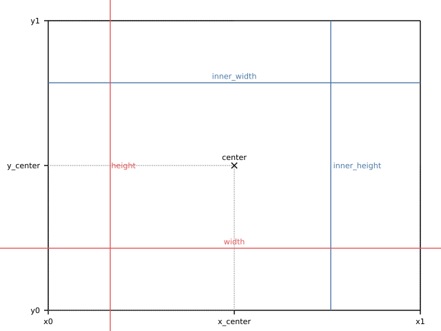

# Frames

The `cdv::fig::frame` data structure in *cdv* is a pure convenience. It is possible to create 
any *cdv* visualization without using frames at all. A frame is a simple data structure that 
makes the very common assumption that a data visualization will exist within a drawing space of a
certain size and that there will be a margin around a main drawing area. The margin may also
be drawn to and will often contain labels, titles, legends and the like. The actual
plotting takes place within the margins - in the main drawing area.

*cdv* establishes some terminology around frames that is best understood in a diagram (this
diagram is also drawn using *cdv*):



As shown in red in the diagram, a frame has a width and a height which are called `width` and
`height`. The extents of the main drawing area - the black rectangle - are called `inner_width`
and `inner_height` respectively and are shown in blue.

Looking at the x-axis there are three labeled positions. `x0` is the position where the main
drawing area starts. The main drawing area ends at position `x1`. And the center of the main
drawing area (not the frame) is called `x_center`. `x_center` is only equal to the center of 
the whole frame if the margins on both sides are equal which is commonly not the case.

A frame also has `y0`, `y1` and `y_center` positions which are equivalent to their x-axis
counterparts. There is also a `center` which provides the x and y centers in a single
two-dimensional point.

Having simple access to these positions and dimensions is helpful when creating scales and
elements in *cdv*, but frames have one more convenience. A frame can provide a corresponding
`cdv::fig::frame_dimensions` object which is what the `render` functions require as an
argument to determine the drawing area. So if you have a frame instance `f`, you can call one
of the `render` functions using `f.dimensions()` as an argument and do not have to create the 
dimensions manually.

Typically, a frame is created:

```c++
constexpr auto frame = cdv::fig::frame();
```
<sup><a href='/tests/approval_tests/cdv/fig/line_charts.cpp#L276-L276' title='Go to snippet source file'>source</a></sup>

then it is used to generate scales and elements. And finally its dimensions are passed to
the render call:

```c++
const auto svg = cdv::fig::render_to_svg_string(frame.dimensions(), x_axis, y_axis, curve);
```
<sup><a href='/tests/approval_tests/cdv/fig/line_charts.cpp#L297-L297' title='Go to snippet source file'>source</a></sup>
